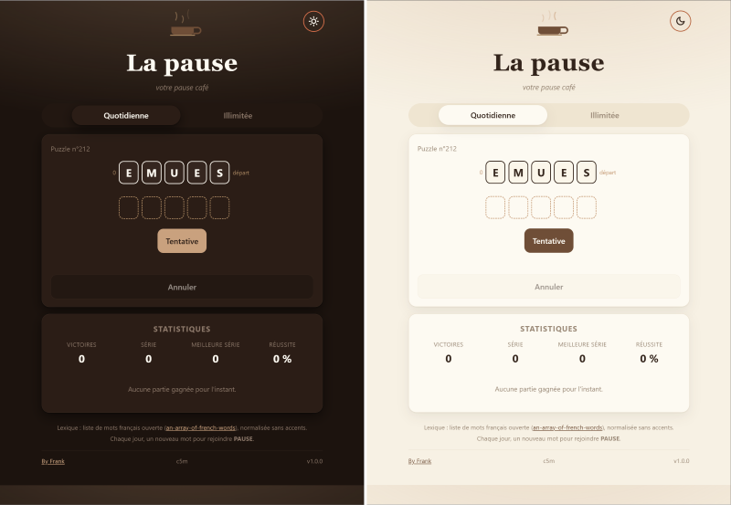

# La pause

Une échelle de mots, sur le thème de la pause café. « Votre pause café ».
Objectif : rejoindre **PAUSE**.



## Règles

- Partez d'un mot de 5 lettres.
- Changez **exactement une lettre** à chaque coup.
- Chaque mot doit être un mot français valide (liste normalisée sans accents).
- Rejoignez **PAUSE** en le moins de coups possible.
- **Annulation** possible, aucune limite de coups, pas d'indices.

## Modes

- **Quotidienne** : un mot par jour, identique pour tous les joueurs (calculé
  de façon déterministe depuis la date à minuit Montréal, sans serveur). La
  grille se verrouille une fois résolue.
- **Illimitée** : un mot de départ aléatoire, résolvable à volonté.

## Statistiques (localStorage)

Reprise de la partie quotidienne en cours au rechargement, série de victoires
consécutives, taux de réussite et répartition des coups. Partage sans spoiler :
`« La pause n°X — 6 coups (par 5) »`.

## Déploiement

Un workflow GitHub Actions construit et publie automatiquement l'image sur Docker Hub lors de chaque release.

```bash
docker compose up          # http://localhost:8080 
```
